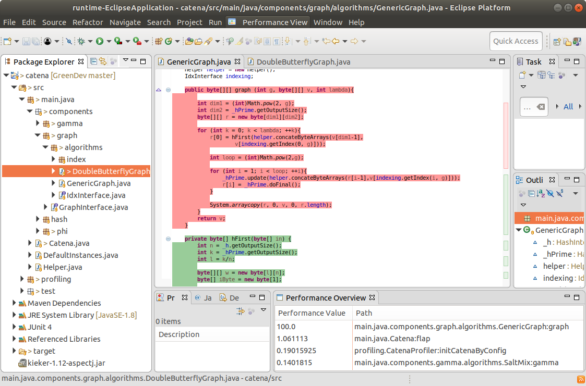

# GreenIDE-Eclipse

GreenIDE-Eclipse is an plugin for the Eclipse IDE. It visualizes non-functional properties of Performance-Influence Models at the method-level. It further shows a list of methods ordered by their energy consumption. It is developed based on the [Vogella](https://www.vogella.com/tutorials/EclipsePlugin/article.html) tutorial.

## How To Install
Download *Eclipse IDE for RCP and RAP Developers* from the Eclipse [download page](https://www.eclipse.org/downloads/packages/). Unzip it and execute the Eclipse executable. Then, open the Eclipse project from the [code](./code/) folder. After that it can be executed by *Run As* -> *Eclipse Application*. A new Eclipse instance opens with the GreenIDE-Eclipse extension.

## How To Use
Once Eclipse runs with the plugin installed, at the top there is the button **Performance View**. On click, the AST of the current project is parsed and the methods of the project are colored according to the respective non-functional property.

This figure shows method *graph*, which is an performance hot-spot (red), whereas method *hFirst* is not (green):

